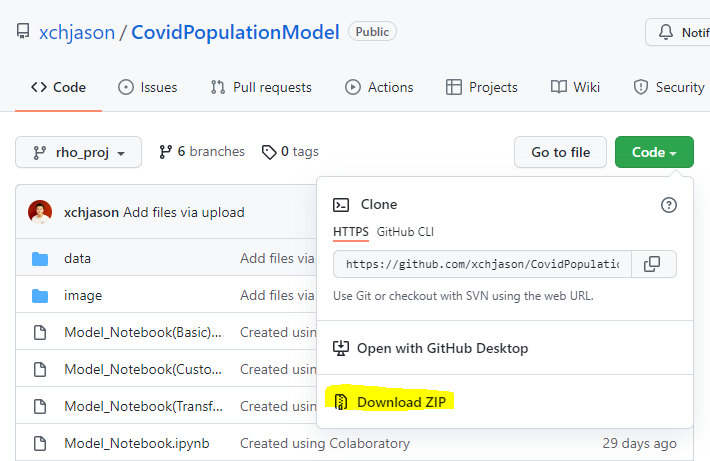
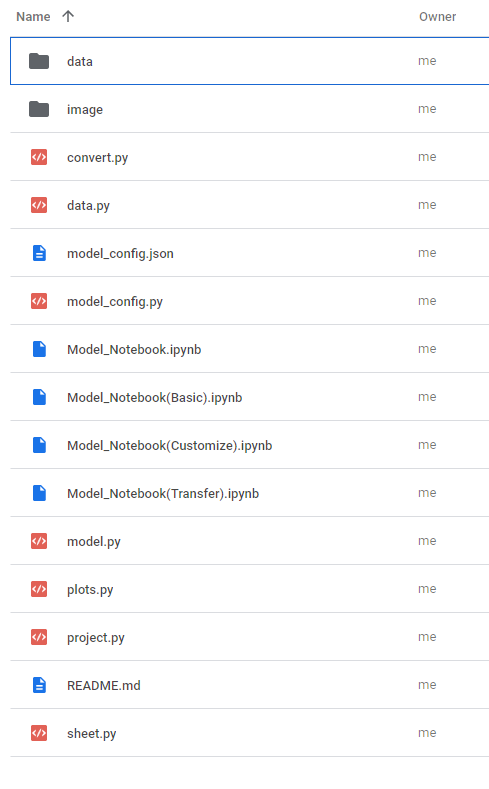
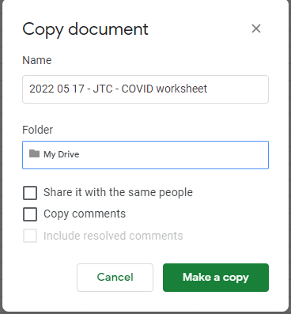
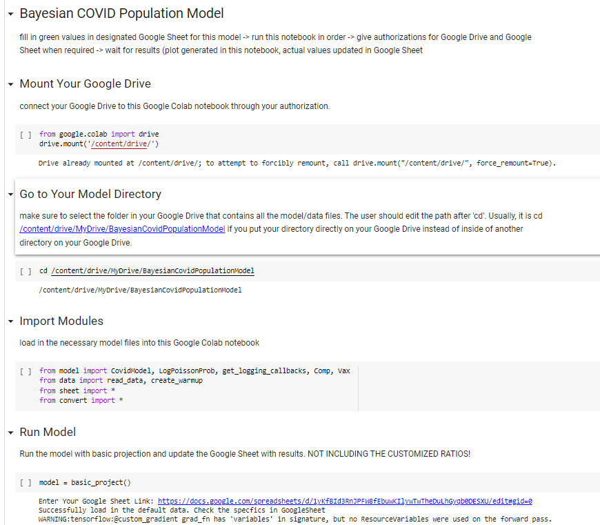

# 1 Covid Population Model
This repository contains the Tufts Susceptible-to-Hospital Forecasting Model for COVID-19. This mechanistic probabilistic model projects how 
- COVID prevalence in the general population may change over time; 
- Disease may progress from infection in susceptible individuals to symptomatic disease and potentially to severe disease; 
- Some individuals may undergo hospitalization; and 
- Hospitalized patients may progress from care in the general ward to more acute care (e.g., in the intensive care unit).
The model has two characteristics that make it a useful tool for estimating the contribution interventions make to population health.  

First, ***the model’s projections align with real world observations*** for a specific geographic region because the model undergoes calibration against empirical data.  Because it is probabilistic, the model characterizes its projections as distributions.  

Second, ***the model can explore an intervention’s impact*** because its mechanistic structure means that it has user-modifiable assumptions representing aspects of COVID that interventions might influence – e.g., the rate at which people become infected, the proportion of people who become sick enough to need hospital care, or how long it takes hospitalized patients to recover enough to be discharged.  The model reports outcomes useful to characterizing intervention value, including how many people become infected, develop severe disease, or die, hospital utilization, and intensive care unit utilization.

Possible research questions this model can help to address include:
- Based on observed trends in Massachusetts in April through July of the current year, how many COVID patients will hospital admit in August?
- What impact would a drug that reduces hospital admissions by 10 percent have on ICU utilization?
- How would a new COVID variant that is 10 percent more transmissible than the current dominant variant affect hospital utilization?

# 2	Preparing the model – Steps you must take once
The model does not require installation of any software on the user's computer.  Instead, it makes use of Google utilities.  The model reports results to a Google workbook.  A future implementation may avoid use of Google utilities and instead rely on local software installation.

Running the model requires:
- A Google spreadsheet workbook referred to as the “control workbook”;
- One of three Google COLAB notebooks, depending on what model features the user wishes to control; and
- Simulation code.

This section describes how to activate the Google utilities needed to install and run the model (Section 2.1) and how to create and populate a folder with the required files and software (Section 2.2).  Section 3 describes how to alter model control features and run the model.

## 2.1 – Activate Google utilities
- The Google Chrome browser (available [here](https://www.google.com/chrome/downloads/))
- A Google Drive account:
  - See [here](https://edu.gcfglobal.org/en/googledriveanddocs/getting-started-with-google-drive/1/) for instructions to set one up.
  - See [here](https://edu.gcfglobal.org/en/googledriveanddocs/) for more information on managing your Google Drive account.
- The Google Colaboratory application - From within your browser go to Google Drive ([here](https://drive.google.com/drive/)): 
  - At the left, click on the “+ New” button ; 
  - Select MORE from the dropdown menu; 
  - Select + CONNECT MORE APPS; 
  - Click on the search icon at the top of the window that pops up (the magnifying glass icon) and search for “colab”.
  - Click on the “Colaboratory” application that appears.
  - Click on the blue INSTALL button.

## 2.2 – Create a Google folder

### Step 2.2.1 – Create a Google folder 
- See instructions [here](https://support.google.com/drive/answer/2375091?hl=en&co=GENIE.Platform%3DDesktop).  
- Name this folder BayesianCovidPopulationModel.

### Step 2.2.2 – Download the contents of the Github page located [here](https://github.com/xchjason/CovidPopulationModel).  
- To do so, click on the green CODE button in the upper right corner of the page and select DOWNLOAD ZIP from the dropdown menu.

  
### Step 2.2.3 – Unzip the downloaded contents.  
- On a Windows computer, find the downloaded Zip file, right click on it, and select EXTRACT ALL.  
- Note the location of the folder created and containing the contents downloaded from the Github page.

### Step 2.2.4 – Upload the material downloaded in Steps 2.2.2 and 2.2.3 to the Google folder created in Step 2.2.1 (BayesianCovidPopulationModel).
- Within your internet browser, go to https://drive.google.com/drive/my-drive.  
- Find the folder created in Step 2.2.1 (BayesianCovidPopulationModel) and double click on it.
- At the left, click on the “+ New” button.
- Select FOLDER UPLOAD.
- A file browser window will open.  Navigate to the folder on your computer created in Step 2.2.3.  Select the folder.  Click on “upload” when prompted.

### Step 2.2.5 – Move the contents in the uploaded folder to the top level of the folder created in Step 2.2.1.  
- Open the folder created in Step 2.2.1 (BayesianCovidPopulationModel).  You will see a single folder.  Open that folder.  Continue to open folders until you get to a list of folders and files that resembles the figure at right. 
- Select all items in this folder by (1) clicking on the first item, (2) holding down the shift key, and (3) clicking on the final item in this list.  All items should now be highlighted.
- Move the items by (1) right clicking and selecting MOVE TO, (2) navigating to the folder created in Step 2.2.1, and (3) clicking on the blue MOVE HERE button.

  
### Step 2.2.6 – Create your own copy of the Google control workbook 
The workbook contains parameter values that control the simulation (see Section 3.2).
- Open the Google workbook template by clicking [here](https://docs.google.com/spreadsheets/d/1yKfBId3RnJPFW8fEbuwKIlywTwTheDuLhGyqb0DESXU/edit#gid=0); 
- Select the FILE dropdown menu and then select MAKE A COPY; 
- In the NAME box, enter a name that is meaningful to you; 
- In the folder box, double-click on the “My Drive” folder and navigate your way to the Google folder created in Step 2.2.1.

 

  

# 3	Running the model

## 3.1 Overview

Running the Tufts COVID model involves these steps: 

### 3.1.1 Open the control workbook (file created in Step 2.2.6)
- Select a **training region** (Section 3.2.1)
- Select a **target region** and **projection period** (Section 3.2.2) 
- Adjust any of these parameters (optional - Section 3.3)

### 3.1.2 Run the simulation
- Open the appropriate COLAB notebook.  
  - Navigate Google project folder (see Section 2.2.2).  
  - Select the notebook you will use (see introduction to Section 3.4)
  - Click on the OPEN IN COLAB button at the top of the notebook.
- Run code segments by clicking on the square brackets to their left. For an illustration, look at the screenshot of the BASIC COLAB notebook below.  
  - That notebook has four code segments, each of which has a set of square brackets (“[ ]”) in its left margin.  
  - To execute a code segment, click on the square brackets.  
  - Note that when you mouse over the square brackets, a right-pointing arrow appears.
  - Google may ask you if you want to grant access to your Google workbook.  If so prompted, reply YES and follow subsequent prompts.
  - As you execute each step, a green checkmark should appear to the left of each segment of executed code. 

## 3.2 Select the training region, target region, and projection period

### 3.2.1 Training region

Select the **training region** by going to the SETTINGS sheet in the control workbook (Section 2.2.6) and modifying the green cell labeled "Trained State" (cell B7).

The training region represents the geographical source of the data that the model uses to "train" (calibrate) these parameters:  
- Duration with mild symptoms (vaxinated or unvaxinated), 
- Duration hospitalized in the general ward (vaxinated or unvaxinated, declining or recovering)
- Duration in the ICU (vaxinated or unvaxinated, declining or recovering)
- Proportion infected who develop mild symptoms
- Proportion with mild symptoms who become hospitalized in the general ward
- Proportion in the general ward who transfer to the ICU
- Proprtion in the ICU who die

### 3.2.2 Target region and projection period

Select the **target region** by going to the SETTINGS sheet in the control workbook (Section 2.2.6) and modifying the green cell to the right of "Target State/Region.  Select the **projection period** by specifying a duration (in days) and a start date in the green cells to the right of "Projection Period".

The target region and projection period represent the geographic region and time period for which the model will generate projected COVID outcomes.  Selection of the target region and projection period influence two sets of parameters:
  - The assumed rate at which COVID infection spreads each day (expressed as RT, the COVID reproductive constant).  Values in excess of 1.0 indicate that the number of infections increases by a factor of RT each day, whereas values below 1.0 indicate exponential decay in the number of cases.  Values for RT come from COVIDESTIM for the target region and projection period.
  - General ward and ICU transfer ratios.  If the training region and target region differ, the number of COVID patients in the hospital general ward and ICU may likewise differ even after accounting for differences in the rate of disease spread (RT).  These differences can reflect 
    - Differences in overall population size (e.g., the population of Massachusetts is about 10 times larger than the population of Vermont) or 
    - Differences in the proportion of individuals who become hospitalized or require ICU care (e.g., the proportion of individuals infected with COVID patients requiring hospital care in Florida may exceed the corresponding proportion in Oklahoma because Florida's population is older. 

## 3.3 Adjust model parameters

You can modify many model parameters by editing their values in the control workbook (see Section 2.2.6).

### 3.3.1 Health state dwell tie distributions
Revise values in the DURATIONS(VAX) and DURATIONS(UNVAX) sheets

### 3.3.2 Health state transition probabilities
Revise values in the TRANSITIONS sheet.  

The parameter “rho” represents the average probability that:
- individuals infected with COVID will develop mild symptoms; 
- individuals with mild COVID symptoms will require care in the hospital general ward; 
- COVID patients receiving care in the hospital general ward will require ICU care, and 
- COVID patients receiving ICU care will die.

### 3.3.3 COVID reproductive value 
Revise values in the CONTEXT sheet. 

This parameter controls the assumed rate at which the prevalence of COVID increases or decreases each day.  That is, it represents the average number of new COVID infections caused by each existing infection; hence when the value of this parameter exceeds 1.0, the simulation model’s assumed population COVID prevalence increases each day.  Values below 1.0 mean prevalence decreases each day.

Note that you can modify values for the training period and the projection period but not for the warmup period.  

### 3.3.4 Transfer ratios
Revise values in the SETTINGS sheet. 

The general ward transfer ratio represents the ratio of the number of patients in the general ward in the target region to the corresponding number of patients in the training region, with both values taken from the first day of the training period.
The ICU transfer ratio represents the corresponding ratio for the intensive care unit.  

The control workbook will recommend values for these transfer ratios based the observed number of patients in the general ward and in the ICU in the target region at the end of the training period.  You can use the defaults or modify them.  For example, if you believe the spread of COVID in the target region lags the spread of COVID in the training region, it might be appropriate to increase the transfer ratio values in anticipation of the target region general ward and ICU counts “catching up” to the corresponding counts in the training region.

## 3.4	Running the model

Open the COLAB notebook - see Section 3.1.2.  

Identify the appropriate notebook to open
  - Mode 1 (Section 3.4.1 - below): Training region and target region **are the same**, with no user revision of the assumptions.
  - Mode 2 (Section 3.4.2 - below): Training region and target region **differ**, with no user revision of the assumptions.
  - Mode 3 (Section 3.4.3 - below): Training region and target region are the same or differ, and the user **does** revise assumptions.

### 3.4.1  Model mode 1 – Training and target regions the same

Use the BASIC COLAB notebook (named “Model_Notebook(Basic).ipynb”).  

Note - The transfer ratios in the control workbook should both be set to 1.

Run the simulation:

  - **CODE SETUP 1**.	Execute BASIC COLAB code segment #1 (“Grant Access to User Google Drive”).
  
  - **CODE SETUP 2**.	Execute BASIC COLAB code segment #2 (“Go to Simulation Folder”).  If named as suggested (BayesianCovidPopulationModel), this code segment will run without any further user-provided information.  Otherwise, the code segment will prompt for the folder location.  To provide this location, navigate to the folder in the browser, copy the browser web address, and paste it into the response box when prompted.
  
  - **CODE SETUP 3**.	Execute BASIC COLAB code segment #3 (“Import Simulation Packages”).  
  
  - **RUN MODEL**.	Execute BASIC COLAB code segment #4 (“Run model”).  This code segment executes the simulation model.  The notebook code will prompt for the control workbook link.  To get this link, open the control workbook, open the SETTINGS sheet, and copy the link address.  Paste this address into the response box and click the ENTER button on the keyboard.  Note that execution of the model can take 5-10 minutes. 

### 3.4.2  Model mode 2 – Training and target regions differ, user leaves assumptions unchanged

Use the TRANSFER COLAB notebook (named "Model_Notebook(Transfer).ipynb").

Run the simulation:
  
- **CODE SETUP 1**.  Same as for Mode 1 - TRANSFER COLAB segment #1 ("Grant Access to User Google Drive).

- **CODE SETUP 2**.  Same as for Mode 1 - TRANSFER COLAB segment #2 (“Go to Simulation Folder”).

- **CODE SETUP 3**.  Same as for Mode 1 - TRANSFER COLAB segment #3 (“Import Simulation Packages”).

- **RUN MODEL**.  Execute TRANSFER COLAB code segment #4 ("Run Model").  Before executing this step, you can modify the transfer ratios in the SETTINGS sheet in the control notebook.

### 3.4.3  Model use mode 3 – User modifies assumptions

Use the TRANSFER COLAB notebook (named "Model_Notebook(Customize).ipynb").
  
Run the simulation:
  
- **CODE SETUP 1**.	Execute CUSTOMIZE COLAB code segment #1 (“Mount Your Google Drive”).  
  - Same as Step A for Modes 1 and 2.

- **CODE SETUP 2**.  Execute CUSTOMIZE COLAB code segment #2 ("Go to Simulation Folder").  
  - Same as Step B for Modes 1 and 2.

- **CODE SETUP 3**.  Execute CUSTOMIZE COLAB code segment #3 (“Import Simulation Package”).  
  - Same as Step C for Modes 1 and 2.

- **CODE SETUP 4**.  Execute CUSTOMIZE COLAB code segment #4 ("Get Location of Control Workbook").  
  - This code segment will prompt for the control workbook link.  
  - To get this link, open the control workbook (Section 2.2.6), open the SETTINGS sheet, and copy the link address.  
  - Paste this address into the response box and click the ENTER button on the keyboard.

- **ADD TO WORKBOOK 1**.  Execute CUSTOMIZE COLAB code segment #5 ("Load Default Values for COVID Rate of Spread in the Population").  
  - This segment loads COVID infection spread rates into the control workbook for the **target region**. 
  - Expressed as Rt, the COVID reproductive constant.  
  - See Context(Rt, Vax_Pct).  
  - The user can subsequently modify the Rt values.

- **ADD TO WORKBOOK 2**.	Execute CUSTOMIZE COLAB code segment #6 (“Import All Parameters to Spreadsheet”).  
  - This segment loads COVID infection spread rates into the control workbook for the **training region**. 
  - Expressed as Rt values.  

- **ADD TO WORKBOOK 3**.  Execute CUSTOMIZE COLAB code segment #7 ("Transfer Suggestion").  
  - This segment calculates recommended transfer ratios.
  - Uses values loaded in **ADD TO WORKBOOK 1** and **ADD TO WORKBOOK 2**.
  - The values reflect  hospital count data and ICU count data from the training region and target region on the first day of the training period.  
  - To save the recommended ratios into the control workbook, respond "Y" to prompt.
  - To retain the original ratios in the control workbook, respond "N" to prompt.

- **UPDATE WORKBOOK**.  Execute CUSTOMIZE COLAB code segment #8 ("Update AllParam").  
  - This code segment synchronizes control workbook entries.
  - Updates parameters for: 
    - Health state dwell time assumptions (DURATIONS(VAX) and DURATIONS(UNVAX) sheets)
    - Transition probabilities (TRANSITIONS sheet).

- **UPDATE JSON**  Execute CUSTOMIZE COLAB code segment #9 ("Update Learned Parameters").  
  - This code segment generates a new json file with the appropriate parameters.
  - **UPDATE WORKBOOK** must run before running **UPDATE JSON**.

- **RUN MODEL**  Execute CUSTOMIZE COLAB code segment #10 ("Project COVID Outcomes with User-Specified assumptions").  
  - Generates simulation projections.
  - **UPDATE JSON** must run before **RUN MODEL**.

