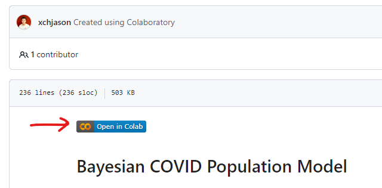

# 1 Covid Population Model
This repository contains the Tufts Susceptible-to-Hospital Forecasting Model for COVID-19. This mechanistic probabilistic model projects how 
- COVID prevalence in the general population may change over time; 
- Disease may progress from infection in susceptible individuals to symptomatic disease and potentially to severe disease; 
- Some individuals may undergo hospitalization; and 
- Hospitalized patients may progress from care in the general ward to more acute care (e.g., in the intensive care unit).
The model has two characteristics that make it a useful tool for estimating the contribution interventions make to population health.  

First, ***the model’s projections align with real world observations*** for a specific geographic region because the model undergoes calibration against empirical data.  Because it is probabilistic, the model characterizes its projections as distributions.  

Second, ***the model can explore an intervention’s impact*** because its mechanistic structure means that it has user-modifiable assumptions representing aspects of COVID that interventions might influence – e.g., the rate at which people become infected, the proportion of people who become sick enough to need hospital care, or how long it takes hospitalized patients to recover enough to be discharged.  The model reports outcomes useful to characterizing intervention value, including how many people become infected, develop severe disease, or die, hospital utilization, and intensive care unit utilization.

Possible research questions this model can help to address include:
- Based on observed trends in Massachusetts in April through July of the current year, how many COVID patients will hospital admit in August?
- What impact would a drug that reduces hospital admissions by 10 percent have on ICU utilization?
- How would a new COVID variant that is 10 percent more transmissible than the current dominant variant affect hospital utilization?

# 2	Preparing the model – Steps you must take once
The model does not require installation of any software on the user's computer.  Instead, it makes use of Google utilities.  The model reports results to a Google workbook.  A future implementation may avoid use of Google utilities and instead rely on local software installation.

## 2 – No local installation – Using Google applications
Running the model requires:
- A Google spreadsheet workbook referred to as the “control workbook”;
- One of three Google COLAB notebooks, depending on what model features the user wishes to control; and
- Simulation code.
This section describes how to activate the Google utilities needed to install and run the model (Section 2.1) and how to create and populate a folder with the required files and software (Section 2.2).  Section 3 describes how to alter model control features and run the model.

### 2.1 – Activate Google utilities
- The Google Chrome browser (available [here](https://www.google.com/chrome/downloads/))
- A Google Drive account:
  - See [here](https://edu.gcfglobal.org/en/googledriveanddocs/getting-started-with-google-drive/1/) for instructions to set one up.
  - See [here](https://edu.gcfglobal.org/en/googledriveanddocs/) for more information on managing your Google Drive account.
- The Google Colaboratory application - From within your browser go to Google Drive ([here](https://drive.google.com/drive/)): 
  - At the left, click on the “+ New” button ; 
  - Select MORE from the dropdown menu; 
  - Select + CONNECT MORE APPS; 
  - Click on the search icon at the top of the window that pops up (the magnifying glass icon) and search for “colab”.
  - Click on the “Colaboratory” application that appears.
  - Click on the blue INSTALL button.

### 2.2 – Create a Google folder

#### Step 2.2.1 – Create a Google folder 
- See instructions [here](https://support.google.com/drive/answer/2375091?hl=en&co=GENIE.Platform%3DDesktop).  
- Name this folder BayesianCovidPopulationModel.

#### Step 2.2.2 – Download the contents of the Github page located [here](https://github.com/xchjason/CovidPopulationModel).  
- To do so, click on the green CODE button in the upper right corner of the page and select DOWNLOAD ZIP from the dropdown menu.

  
#### Step 2.2.3 – Unzip the downloaded contents.  
- On a Windows computer, find the downloaded Zip file, right click on it, and select EXTRACT ALL.  
- Note the location of the folder created and containing the contents downloaded from the Github page.

#### Step 2.2.4 – Upload the material downloaded in Steps 2.2.2 and 2.2.3 to the Google folder created in Step 2.2.1 (BayesianCovidPopulationModel).
- Within your internet browser, go to https://drive.google.com/drive/my-drive.  
- Find the folder created in Step 2.2.1 (BayesianCovidPopulationModel) and double click on it.
- At the left, click on the “+ New” button.
- Select FOLDER UPLOAD.
- A file browser window will open.  Navigate to the folder on your computer created in Step 2.2.3.  Select the folder.  Click on “upload” when prompted.

#### Step 2.2.5 – Move the contents in the uploaded folder to the top level of the folder created in Step 2.2.1.  
- Open the folder created in Step 2.2.1 (BayesianCovidPopulationModel).  You will see a single folder.  Open that folder.  Continue to open folders until you get to a list of folders and files that resembles the figure at right. 
- Select all items in this folder by (1) clicking on the first item, (2) holding down the shift key, and (3) clicking on the final item in this list.  All items should now be highlighted.
- Move the items by (1) right clicking and selecting MOVE TO, (2) navigating to the folder created in Step 2.2.1, and (3) clicking on the blue MOVE HERE button.

  
#### Step 2.2.6 – Create your own copy of the Google control workbook 
Thiw workbook contains parameter values that control the simulation (see Section 3.2).
- Open the Google workbook template by clicking [here](https://docs.google.com/spreadsheets/d/1yKfBId3RnJPFW8fEbuwKIlywTwTheDuLhGyqb0DESXU/edit#gid=0); 
- Select the FILE dropdown menu and then select MAKE A COPY; 
- In the NAME box, enter a name that is meaningful to you; 
- In the folder box, double-click on the “My Drive” folder and navigate your way to the Google folder created in Step 2.2.1.

 

  

# 3	Running the model

## 3.1 Overview

Running the Tufts COVID model involves 3 steps: 

- Selecting a **training region**
- Selecting a **target region** and **projection period**
- Optionally adjusting any of these parameters

### 3.1.1 Selecting a training region

Select the **training region** by going to the SETTINGS sheet in the control workbook (Section 2.2.6) and modifying the green cell labeled "Trained State" (cell B7).

The training region represents the geographical source of the data that the model uses to "train" (calibrate) these parameters:  
- Duration with mild symptoms (vaxinated or unvaxinated), 
- Duration hospitalized in the general ward (vaxinated or unvaxinated, declining or recovering)
- Duration in the ICU (vaxinated or unvaxinated, declining or recovering)
- Proportion infected who develop mild symptoms
- Proportion with mild symptoms who become hospitalized in the general ward
- Proportion in the general ward who transfer to the ICU
- Proprtion in the ICU who die

### 3.1.2 Selecting a target region and projection period

Select the **target region** by going to the SETTINGS sheet in the control workbook (Section 2.2.6) and modifying the green cell to the right of "Target State/Region.  Select the **projection period** by specifying a duration (in days) and a start date in the green cells to the right of "Projection Period".

The target region and projection period represent the geographic region and time period for which the model will generate projected COVID outcomes.  Selection of the target region and projection period influence two sets of parameters:
  - The assumed rate at which COVID infection spreads each day (expressed as RT, the COVID reproductive constant).  Values in excess of 1.0 indicate that the number of infections increases by a factor of RT each day, whereas values below 1.0 indicate exponential decay in the number of cases.  Values for RT come from COVIDESTIM for the target region and projection period.
  - General ward and ICU transfer ratios.  If the training region and target region differ, the number of COVID patients in the hospital general ward and ICU may likewise differ even after accounting for differences in the rate of disease spread (RT).  These differences can reflect 
    - Differences in overall population size (e.g., the population of Massachusetts is about 10 times larger than the population of Vermont) or 
    - Differences in the proportion of individuals who become hospitalized or require ICU care (e.g., the proportion of individuals infected with COVID patients requiring hospital care in Florida may exceed the corresponding proportion in Oklahoma because Florida's population is older. 

### 3.1.3 Adjusting parameters (optional)

Procedures for running the model depend on (1) whether the training region and target region differ, and (2) whether you wish to modify any of the parameters the model identifies.  There are three model modes:
- Mode 1 (Section 3.1 - below): Training region and target region **are the same**, with no user revision of the assumptions.
- Mode 2 (Section 3.2 - below): Training region and target region **differ**, with no user revision of the assumptions.
- Mode 3 (Section 3.3 - below): Training region and target region are the same or differ, and the user **does** revise assumptions.

## 3.2 Modifying model parameters

You can modify many model parameters by editing their values in the control workbook (see Section 2.2.6).

### 3.2.1 Health state dwell tie distributions
Revise values in the DURATIONS(VAX) and DURATIONS(UNVAX) sheets

### 3.2.2 Health state transition probabilities
Revise values in the TRANSITIONS sheet.  

The parameter “rho” represents the average probability that:
- individuals infected with COVID will develop mild symptoms; 
- individuals with mild COVID symptoms will require care in the hospital general ward; 
- COVID patients receiving care in the hospital general ward will require ICU care, and 
- COVID patients receiving ICU care will die.

### 3.2.3 COVID reproductive value 
Revise values in the CONTEXT sheet. 

This parameter controls the assumed rate at which the prevalence of COVID increases or decreases each day.  That is, it represents the average number of new COVID infections caused by each existing infection; hence when the value of this parameter exceeds 1.0, the simulation model’s assumed population COVID prevalence increases each day.  Values below 1.0 mean prevalence decreases each day.

Note that you can modify values for the training period and the projection period but not for the warmup period.  

### 3.2.4 Transfer ratios
Revise values in the SETTINGS sheet. 

The general ward transfer ratio represents the ratio of the number of patients in the general ward in the target region to the corresponding number of patients in the training region, with both values taken from the first day of the training period.
The ICU transfer ratio represents the corresponding ratio for the intensive care unit.  

The control workbook will recommend values for these transfer ratios based the observed number of patients in the general ward and in the ICU in the target region at the end of the training period.  You can use the defaults or modify them.  For example, if you believe the spread of COVID in the target region lags the spread of COVID in the training region, it might be appropriate to increase the transfer ratio values in anticipation of the target region general ward and ICU counts “catching up” to the corresponding counts in the training region.

## 3.3	Running the model

For any of these modes, specify a **projection period**, i.e., a range of dates for which the model will project the number of individuals who develop symptomatic COVID, the number requiring care in the hospital general ward, the number requiring ICU care, and the number dying from COVID.  To specify the projection period:
- Go to the Settings sheet in the workbook created in step 2.2.6.
- Find the row labeled "Projection Period".
- Enter the length of the projection period and the first day of the projection period in the appropriate columns.
  
Run the model by executing code segments embedded in a Google COLAB notebook.   
  
The screenshot below shows the BASIC COLAB notebook.  The BASIC COLAB notebook has four code segments, each of which has a set of square brackets (“[ ]”) in its left margin.  To execute a code segment, click on the square brackets.  (Note that when you mouse over the square brackets, a right-pointing arrow appears).
Google may ask you if you want to grant access to your Google workbook.  If so prompted, reply YES and follow subsequent prompts.
As you execute each step, a green checkmark should appear to the left of each segment of executed code. 

  
### 3.3.1  Model mode 1 – Training and target regions the same

In this case, the model warehouse contains an assumption set calibrated (i.e., “trained”) using data from the region to be simulated (the target region).  

#### 3.3.1.1 Open control workbook 
- See file created in Step 2.2.6.  
- Select and open the SETTINGS sheet.
- Select the **training region** - i.e., the region serving as the source of the empirical COVID population and hospital utilization data used to calibrate the model assumptions.
- Specify the  **training period** – i.e., the time period for the empirical COVID population and hospital utilization data used to calibrate the model assumptions (see Section 3.1.3 for more detail).
- Select the **target region** from both the training dropdown list and from the target region dropdown list.  Be sure it matches the **training region**.
- Specify the **projection period** date range.
- Set the **transfer ratios** to 1.0 for general ward and intensive care.  These constants scale the training region general ward and ICU patient projections to produce corresponding estimates for the target region.  When the training and target ratios are the same, these ratios should be 1.0 because no scaling of these values is necessary.

#### 3.3.1.2 Open the BASIC COLAB notebook:
- Navigate to the Google drive folder created for this simulation (Section 2.2).
- Click on the BASIC COLAB notebook (named “Model_Notebook(Basic).ipynb”).
- Click on the OPEN IN COLAB button at the top of the notebook. 

#### 3.3.1.3 Run the simulation:
- A.	Execute BASIC COLAB code segment #1 (“Grant Access to User Google Drive”).
  
- B.	Execute BASIC COLAB code segment #2 (“Go to Simulation Folder”).  If named as suggested (BayesianCovidPopulationModel), this code segment will run without any further user-provided information.  Otherwise, the code segment will prompt for the folder location.  To provide this location, navigate to the folder in the browser, copy the browser web address, and paste it into the response box when prompted.
  
- C.	Execute BASIC COLAB code segment #3 (“Import Simulation Packages”).  
  
- D.	Execute BASIC COLAB code segment #4 (“Run model”).  This code segment executes the simulation model.  The notebook code will prompt for the control workbook link.  To get this link, open the control workbook, open the SETTINGS sheet, and copy the link address.  Paste this address into the response box and click the ENTER button on the keyboard.  Note that execution of the model can take 5-10 minutes. 

### 3.3.2  Model mode 2 – Training and target regions differ, user leaves assumptions unchanged
 

Open the TRANSFER COLAB notebook:
- Navigate to the Google drive folder created for this simulation (Section 2.2).
- Click on the TRANSFER COLAB notebook (named “Model_Notebook(Transfer).ipynb”).
- Click on the OPEN IN COLAB button at the top of the notebook. 
Open the control workbook:
- Navigate to the control workbook and click on it to open.
- Select and open the SETTINGS sheet.

Run the simulation:
  
- A.	Execute TRANSFER COLAB code segment #1 (“Mount Your Google Drive”).  This step grants access to the Google drive.
  
- B.	Execute TRANSFER COLAB code segment #2 (“Go to your model directory”).  This step directs the COLAB notebook to the user-created folder containing the simulation application.  If named as suggested (BayesianCovidPopulationModel), this code segment will run without any further user-provided information.  Otherwise, the code segment will prompt for the folder location.  To provide this location, navigate to the folder in the browser, copy the browser web address, and paste it into the response box when prompted.
  
- C.	Execute TRANSFER COLAB code segment #3 (“Import modules”).  This code segment loads the model into the Google COLAB notebook.
  
- D.	Specify the training region, target region, and date range for which the simulation will make COVID projections.  Go to the control workbook and select the SETTINGS sheet.  For example, set the training region to “Massachusetts” and the target region to “Vermont”.  The workbook will recommend transfer ratio values after execution of code segment #3.  If you want to change them, follow the instructions for Model mode 3 (below).  Set the date range for the PROJECTION PERIOD.
  
- E.	Execute TRANSFER COLAB code segment #4 (“Transfer the Learned Parameters to Test on a New State”).  This code segment executes the simulation model.  The notebook code will prompt for the control workbook link.  To get this link, open the control workbook, open the SETTINGS sheet, and copy the link address.  Paste this address into the response box and click the ENTER button on the keyboard.  Note that execution of the model can take 5-10 minutes.

### 3.3.3  Model use mode 3 – User modifies assumptions
  

  
Open the CUSTOMIZE COLAB notebook:
- Navigate to the Google drive folder created for this simulation (Section 2.2).
- Click on the CUSTOMIZE COLAB notebook (named “Model_Notebook(Customize).ipynb”).
- Click on the OPEN IN COLAB button at the top of the notebook. 
Open the control workbook:
- Navigate to the control workbook and click on it to open.
- Select and open the SETTINGS sheet.
  
Run the simulation:
  
- A.	Execute CUSTOMIZE COLAB code segment #1 (“Go to Simulation Folder”).  This step grants access to the Google drive.
  
- B.	Execute CUSTOMIZE COLAB code segment #2 (“Go to your model directory”).  This step directs the COLAB notebook to the user-created folder containing the simulation application.  If named as suggested (BayesianCovidPopulationModel), this code segment will run without any further user-provided information.  Otherwise, the code segment will prompt for the folder location.  To provide this location, navigate to the folder in the browser, copy the browser web address, and paste it into the response box when prompted.
  
- C.	Execute CUSTOMIZE COLAB code segment #3 (“Import Simulation Package”).  This code segment loads the model into the Google COLAB notebook.
  
- D.	Specify the training region, target region, and date range for which the simulation will make COVID projections.  Go to the control workbook and select the SETTINGS sheet.  For example, set the training region to “Massachusetts” and the target region to “Vermont”.  The workbook will recommend transfer ratio values after execution of code segment #3.  You can revise these values or leave them unchanged.  Set the date range for the PROJECTION PERIOD.
  
- E.	Execute CUSTOMIZE COLAB code segment #4 (“Get Location of Control Workbook”).  The notebook code will prompt for the control workbook link.  To get this link, open the control workbook, open the SETTINGS sheet, and copy the link address.  Paste this address into the response box and click the ENTER button on the keyboard.  
  
- F.	Execute CUSTOMIZE COLAB code segment #5 (“Load Default Values for COVID Rate of Spread in the Population”).  This code segment loads the default values for the COVID rate of spread in the population of the target state into the CONEXT sheet.
  
- G.	Execute CUSTOMIZE COLAB code segment #6 (“Import All Parameters to Spreadsheet”).  This code segment loads all the parameters representing the training region and training period.
  
- H.	Execute CUSTOMIZE COLAB code segment #7 (“Transfer suggestion”) if you want to reset the transfer ratios to their simulation-recommended values.  In response to the prompt (“Do you want to update with recommended ratios for your selected state (Y/N)?”  
  -  Answering “Y” updates the values as described;
  - Answering “N” makes no change to the values
  
- I.	Modify user-accessible assumptions in the model.  These assumptions appear in cells that are shaded green in any sheet.
  
- J.	Execute CUSTOMIZE COLAB segment #8 (“Update AllParam”).  This code segment incorporates user-specified revisions to the DURATIONS and TRANSITIONS sheets.  Always run this code segment before running the simulation.
  
- K.	Execute CUSTOMIZE COLAB segment #9 (“Update learned parameters”).  This code segment creates a new json file.
  
- L.	Execute CUSTOMIZE COLAB segment #10 (“Project COVID Outcomes with User-Specified Assumptions”).
After running the model, the user can modify assumptions and proceed to run the model again.  The user can make modifications at steps D, H, and I in this list.  Be sure to execute all subsequent steps.  For example, following modification of the training region (part of Step D), follow steps E, F, and so forth.
